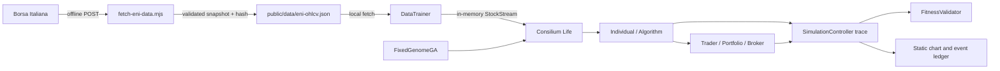
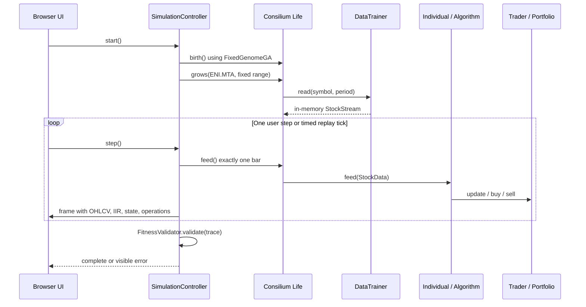

# Simulator Overview

last_verified: 2026-09-28

## Purpose

SwarmTrader replays one immutable Consilium genome over ENI daily OHLCV data through 28/09/2026 inclusive. It is a historical inspection tool, not a trading system or profitability claim.

## Components

- [Data acquisition script](../../scripts/fetch-eni-data.mjs) downloads and validates the Borsa Italiana response offline. It writes `public/data/eni-ohlcv.json` atomically with date coverage and SHA-256 metadata.
- [DataTrainer](../../src/engine/dataTrainer.js) validates the snapshot and exposes Consilium `StockStream` objects from memory. It performs no network request.
- [Genome adapter](../../src/engine/genome.js) validates the provided snake_case genome and maps percentage fields to the fractional camelCase values expected by Consilium.
- [FixedGenomeGA](../../src/engine/fixedGenomeGA.js) supplies exactly one `Individual`; it does not mutate, cross, or evolve the genome.
- [SimulationController](../../src/engine/simulationController.js) connects `Life`, `Individual`, and `DataTrainer`, advances one bar at a time, and records the actual state, IIR values, portfolio and broker closes.
- [FitnessValidator](../../src/engine/fitnessValidator.js) checks chronological frames, finite IIR values, OHLC/trade coherence, and position quantity invariants. It does not evaluate profitability.
- [Browser UI](../../src/main.js) renders candles, volume, IIR, transitions and broker events in a static browser UI.
- `src/vendor/consilium/` contains the selected upstream browser modules at the pinned commit; the MIT license and local browser-only deltas are documented there.

## Data flow

## Replay lifecycle

## Constraints

- The app has no runtime backend; only the data refresh script uses network access.
- Dates are UTC `YYYY-MM-DD`; no bars after 28/09/2026 are admitted.
- The API's observed latest bar on first acquisition was 28/09/2026; the UI reports snapshot coverage rather than synthesizing missing market dates.
- The data file is versioned in Git: the Owner confirmed on 29/09/2026 that Borsa Italiana terms permit its reuse.
- The vendor fork removes only the disabled low-cap profile URL and unused Node `fs`/`path` plus `csvLoader` imports. Trading and Portfolio code remains upstream.