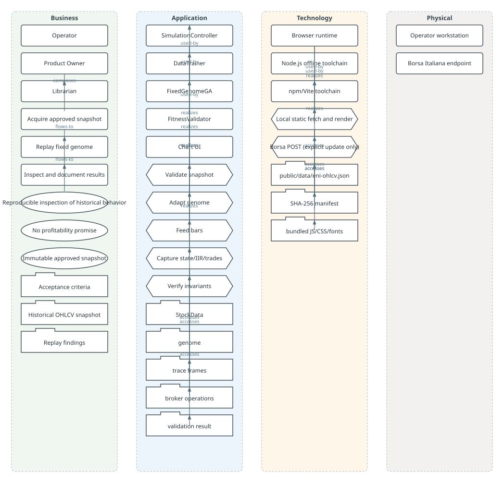

# Use Case: Replay ENI with Fixed Genome

last_verified: 2026-09-29

## Goal

Inspect the behavior of the supplied fixed trader genome against an immutable ENI daily OHLCV snapshot, with every chart marker traceable to the Consilium engine frame that produced it.

## ArchiMate source

The ArchiMate model for this use case lives as a structured data source in [`archimate/eni-replay/`](../../archimate/eni-replay/) — one markdown file per pertinent cell (Service Layer × Aspect), each with a YAML frontmatter declaring elements and relationships against [`archimate/_vocabulary.md`](../../archimate/_vocabulary.md). The diagram below and the matrix are **derived** from those cells by `scripts/gen-archimate.mjs`; do not edit them by hand.

## Rendered diagram



The SVG above is generated directly from the cell frontmatter (`npm run archimate:svg`), with no PlantUML or external renderer. The PlantUML block below is the diagram-as-code authoritative source; the SVG is the rendered view for GitHub Pages.

<!-- archimate:gen start -->
```plantuml
@startuml
archimate
skinparam linetype ortho

package "business" {
  rectangle "Operator" as bus_actor_operator
  rectangle "Product Owner" as bus_role_owner
  rectangle "Librarian" as bus_role_librarian
  rectangle "Acquire approved snapshot" as bus_proc_acquire
  rectangle "Replay fixed genome" as bus_proc_replay
  rectangle "Inspect and document results" as bus_proc_inspect
  usecase "Reproducible inspection of historical behavior" as bus_goal_inspect
  usecase "No profitability promise" as bus_val_noprofit
  usecase "Immutable approved snapshot" as bus_req_snapshot
  folder "Acceptance criteria" as bus_obj_acceptance
  folder "Historical OHLCV snapshot" as bus_obj_snapshot
  folder "Replay findings" as bus_obj_findings
}

package "application" {
  component "SimulationController" as app_sim_ctrl
  component "DataTrainer" as app_data_trainer
  component "FixedGenomeGA" as app_ga
  component "FitnessValidator" as app_validator
  component "Chart UI" as app_chart_ui
  hexagon "Validate snapshot" as app_svc_validate
  hexagon "Adapt genome" as app_svc_adapt
  hexagon "Feed bars" as app_svc_feed
  hexagon "Capture state/IIR/trades" as app_svc_capture
  hexagon "Verify invariants" as app_svc_verify
  folder "StockData" as app_data_stockdata
  folder "genome" as app_data_genome
  folder "trace frames" as app_data_trace
  folder "broker operations" as app_data_ops
  folder "validation result" as app_data_validation
}

package "technology" {
  node "Browser runtime" as tech_browser
  node "Node.js offline toolchain" as tech_node
  node "npm/Vite toolchain" as tech_vite
  hexagon "Local static fetch and render" as tech_svc_render
  hexagon "Borsa POST (explicit update only)" as tech_svc_borsa
  artifact "public/data/eni-ohlcv.json" as tech_art_snapshot
  artifact "SHA-256 manifest" as tech_art_hash
  artifact "bundled JS/CSS/fonts" as tech_art_bundle
}

package "physical" {
  node "Operator workstation" as phys_workstation
  node "Borsa Italiana endpoint" as phys_borsa
}

app_sim_ctrl --> app_data_trainer
app_sim_ctrl --> app_ga
app_chart_ui --> app_sim_ctrl
app_sim_ctrl ..> app_svc_feed
app_sim_ctrl ..> app_svc_capture
app_validator ..> app_svc_verify
app_data_trainer ..> app_svc_validate
app_ga ..> app_svc_adapt
app_svc_capture --> app_data_trace
app_svc_capture --> app_data_ops
app_svc_verify --> app_data_validation
bus_role_owner *-- bus_role_librarian : documentation governance
bus_proc_acquire --> bus_proc_replay
bus_proc_replay --> bus_proc_inspect
tech_browser --> tech_vite
tech_node --> tech_vite
tech_browser ..> tech_svc_render
tech_node ..> tech_svc_borsa
tech_svc_render --> tech_art_bundle
tech_svc_render --> tech_art_snapshot
tech_svc_borsa --> tech_art_snapshot
tech_svc_borsa --> tech_art_hash
@enduml
```
<!-- archimate:gen end -->

## Service Layer × Aspect matrix (derived)

<!-- archimate:matrix start -->
| Service Layer | Motivation | Active structure | Behaviour | Passive structure |
|---------------|------------|-----------------|-----------|-------------------|
| Business | Reproducible inspection of historical behavior, No profitability promise, Immutable approved snapshot | Operator, Product Owner, Librarian | Acquire approved snapshot, Replay fixed genome, Inspect and document results | Acceptance criteria, Historical OHLCV snapshot, Replay findings |
| Application | — | SimulationController, DataTrainer, FixedGenomeGA, FitnessValidator, Chart UI | Validate snapshot, Adapt genome, Feed bars, Capture state/IIR/trades, Verify invariants | StockData, genome, trace frames, broker operations, validation result |
| Technology | — | Browser runtime, Node.js offline toolchain, npm/Vite toolchain | Local static fetch and render, Borsa POST (explicit update only) | public/data/eni-ohlcv.json, SHA-256 manifest, bundled JS/CSS/fonts |
| Physical | — | Operator workstation, Borsa Italiana endpoint | — | — |
<!-- archimate:matrix end -->

## Preconditions

- The local snapshot exists and its SHA-256, schema, cutoff and bars validate.
- The fixed genome maps to the Consilium `Genoma` model without mutating source values.
- `FitnessValidator` has no blocking errors.

## Main flow

1. The operator opens the browser UI; the static snapshot loads and its hash is checked.
2. The UI shows actual date coverage, bar count, and source metadata.
3. Starting replay creates one Individual via `FixedGenomeGA`, then loads the in-memory stream.
4. Each step feeds exactly one bar to `Life`; state, IIR, portfolio and broker operations are captured.
5. The chart overlays IIR and actual Broker buy/sell/stop/take-profit fills; the optional state layer marks transitions.
6. At EOF, `FitnessValidator` checks the complete trace and the UI reports completion or visible errors.

## Failure paths

- Missing/corrupt snapshot or hash mismatch: show an error; keep controls disabled.
- Invalid OHLCV or date coverage: reject before creating the Individual.
- `Life.feed()` fails before EOF: stop replay and show an error; never label it complete.
- Borsa endpoint unavailable during refresh: preserve the last valid snapshot atomically; no browser runtime request is made.
